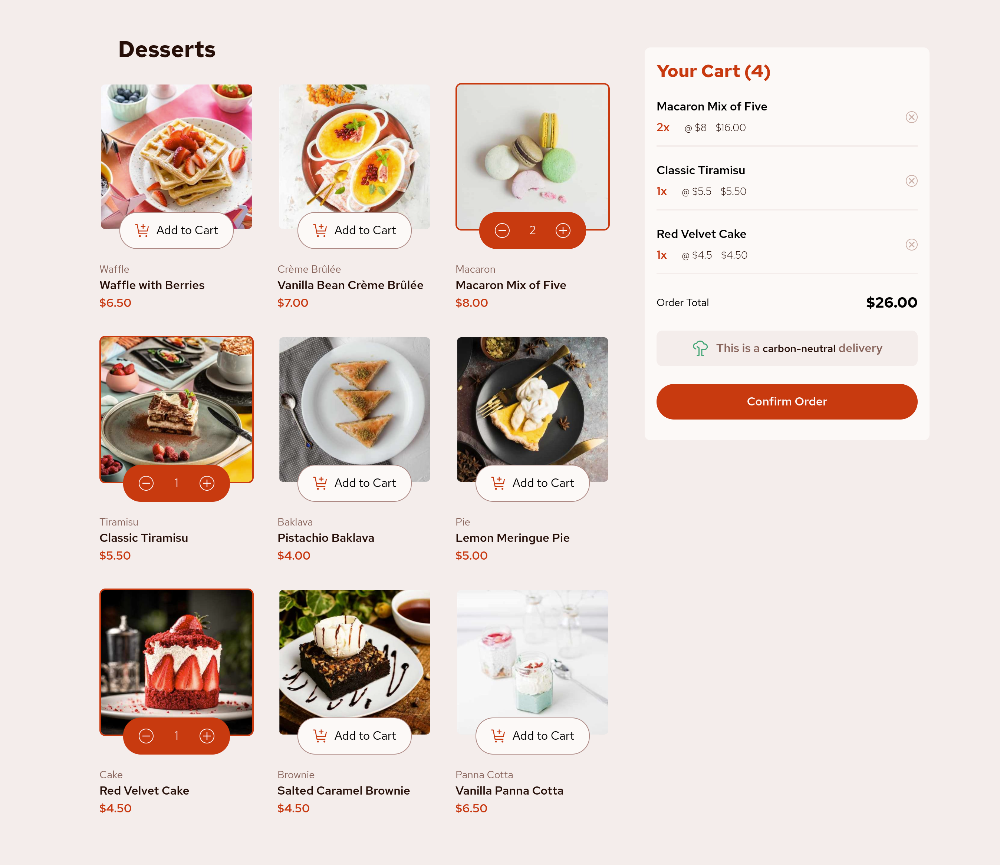
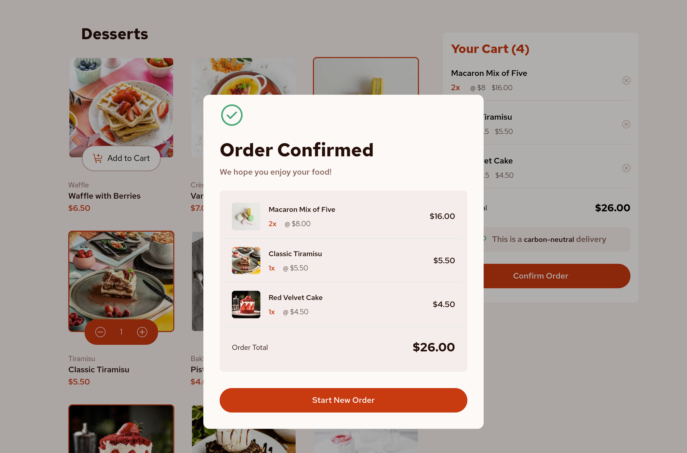

# 🍰 Dessert Shop - Product Listing and Cart Management

This project is a frontend implementation of a dessert shop application focusing on product listing and cart management functionalities. It replicates core features found in e-commerce platforms like Amazon or Flipkart, showcasing how products are displayed and managed within a shopping cart 🛒.

## 🌟 Features

- **Product Listing:** Displays a variety of desserts fetched from a JSON data source.
- **Cart Management:** Allows users to add, remove, and views items in the cart.
- **Order Confirmation:** Provides a streamlined checkout process with an order confirmation window.

## 🛠️ Technologies Used

- React
- Tailwind CSS 🌈
- Context API

## 📝 Implementation Details

### Product Listing

The `DessertContainer` components fetches dessert data dynamically from a JSON file and renders each dessert item using the `DessertCard` component. It employs responsive design principles to optimize display across different screen sizes.

### Cart Management

The `Cart` component manages cart items (`cartItems`) and calculates the total order price (`totalOrderPrice`). Users can add or remove items from the cart, and upon order confirmation, the cart state is reset.

### User Interaction

- *AddToCartButton* allows users to increment or decrement item quantities in the cart.
- *OrderConfirmedWindow* displays a confirmation message after the order is placed, with options to start a new order.

## 🖼️ Screenshots

## 🎉 Credits

This project is inspired by the [Frontend Mentor](https://www.frontendmentor.io/) challenge, focusing on frontend development skills and best practices.

## 📬 Feedback and Suggestions

Your feedback is valuable! If you have any suggestions, ideas, or improvements for this project, please feel free to open an issue or submit a pull request. Your contributions are welcomed and appreciated 🚀.
